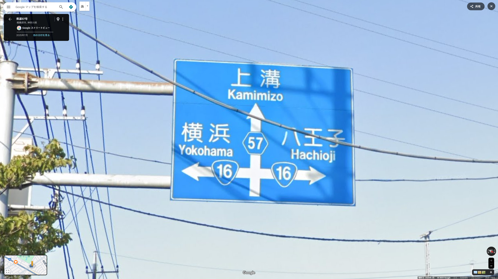
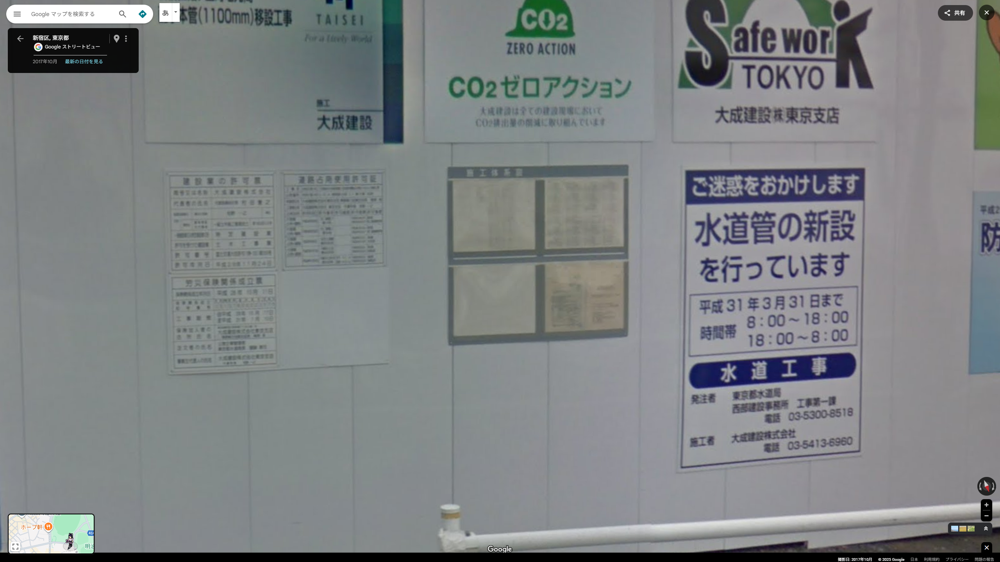

# GeoGurssr-intro

## 0. GeoGuesserとは
ランダムに選ばれたGoogleストリートビューが表示され、その場所を街中のヒントをもとにGoogleマップ上で当てるゲームである。

> [!IMPORTANT]
> 当講義では、日本マップ(日本国内でランダムにスポーンする)のみを使用する。世界マップは暗記要素が多いため取り扱わない。
>   
> 以下の要素がわかることを期待する。
> ```
> 1. Googleマップ及びストリートビューの操作方法がわかる
> 2. 47都道府県の場所と名前が一致しており、各都道府県庁所在地、政令指定都市等の大都市の場所と名前が大体わかる
> ```

## 1. 系統地理

### 1.1. 青看板
日本の青看板には地名,道路番号等の重要な情報が書いてある。
日本マップにおいて、青看板は地域,ひいては初期地点を特定するうえで**最重要情報**となる。    
  

### 1.2. カーブミラー
カーブミラーにはそれを管理する自治体(都道府県,市町村)が記載してあることがある。
  

### 1.3. その他の標示

#### 1.3.1. 工事看板
工事看板には次のような情報が書いてある。
1. 工事発注者(及び電話番号)
2. 建築敷地の地名地番
  

#### 1.3.2. 広告看板

### 1.4. 主要施設

#### 1.4.1. コンビニエンスストア
#### 1.4.2. ロードサイド店舗
#### 1.4.3. ホテル
#### 1.4.5. 病院
#### 1.4.6. 教育施設

### 1.5. 電話番号

### 1.6. 電柱

## 2. 地誌

### 2.1. 北海道地方

### 2.2. 東北地方

### 2.3. 関東地方

### 2.4. 東海地方

### 2.5. 北陸地方

### 2.6. 近畿地方

### 2.7. 中国地方

### 2.8. 四国地方

### 2.9. 九州地方

### 2.10. 沖縄地方