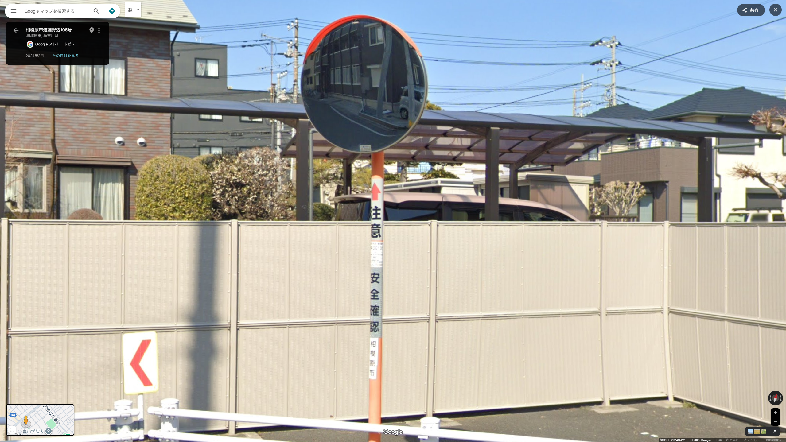

# GeoGurssr-intro

## 0. GeoGuesserとは
ランダムに選ばれたGoogleストリートビューが表示され、その場所を街中のヒントをもとにGoogleマップ上で当てるゲームである。

> [!IMPORTANT]
> 当講義では、日本マップ(日本国内でランダムにスポーンする)のみを使用する。世界マップは暗記要素が多いため取り扱わない。
>   
> 以下の要素がわかることを期待する。
> ```
> 1. Googleマップ及びストリートビューの操作方法がわかる
> 2. 47都道府県の場所と名前が一致しており、各都道府県庁所在地、政令指定都市等の大都市の場所と名前が大体わかる
> ```

## 1. 系統地理

### 1.1. 青看板
日本の青看板には地名,道路番号等の重要な情報が書いてある。
日本マップにおいて、青看板は地域,ひいては初期地点を特定するうえで**最重要情報**となる。    
  

### 1.2. カーブミラー
カーブミラーにはそれを管理する自治体(都道府県,市町村)が記載してあることがある。
  

### 1.3. その他の標示

#### 1.3.1. 工事看板
工事看板には次のような情報が書いてある。
1. 工事発注者(及び電話番号)
2. 建築敷地の地名地番
3. 他  
    工事施工者(及び電話番号)  
    建築物の名称  
    建築主(及び電話番号)  
    設計者(及び電話番号)  
    etc.  
  

#### 1.3.2. 広告看板
広告看板には地名が書いてあることがある。  
  
  

### 1.4. 主要施設

#### 1.4.1. コンビニエンスストア
ファミリーマートには店名の記載がある。  
セイコーマートは北海道及び茨城県,埼玉県東部のみに店舗があるため地域の絞り込みに使える。  
  
  

#### 1.4.2. ロードサイド店舗
飲食店,ドラッグストア等の小売店は地図上で比較的簡単に見つけられるため目印に使うことができる。  
特に飲食店(外食チェーン)は大通り沿い,ドラッグストアは住宅街にあることが多い。  
  

#### 1.4.3. ホテル
ホテルは人通りの多い位置に立地するため探索中の目印となる。  
ビジネスホテル,シティホテルは駅周辺や繁華街に,ラブホテルはインターチェンジや国道沿いに立地することが多い。  
  

#### 1.4.4. 病院
病院(総合病院)は引きで見ても表示されることが多いので地図上を探すうえでの目印となる。  
病院(診療所)は拡大してもなかなか表示されないので最終的な地点の確認等での利用にとどまることが多い。  
  

#### 1.4.6. 教育施設

### 1.5. 電話番号

### 1.6. 電柱

## 2. 地誌

### 2.1. 北海道地方

### 2.2. 東北地方

### 2.3. 関東地方

### 2.4. 東海地方

### 2.5. 北陸地方

### 2.6. 近畿地方

### 2.7. 中国地方

### 2.8. 四国地方

### 2.9. 九州地方

### 2.10. 沖縄地方